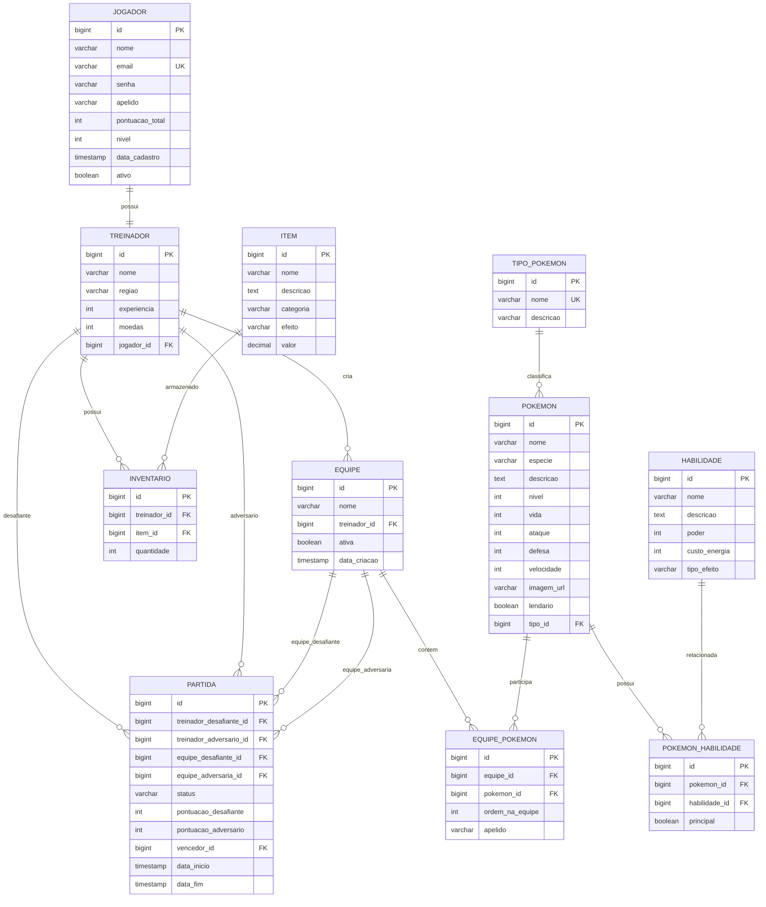

# DER - Pokemon Game API

O diagrama abaixo representa a modelagem inicial do banco de dados para o backend do jogo.

## Relacionamentos principais

| Relacionamento | Cardinalidade | Descricao |
|---|---:|---|
| Jogador - Treinador | 1:1 | Cada jogador ativo possui um treinador principal. |
| Treinador - Equipe | 1:N | Um treinador pode criar varias equipes. |
| Treinador - Inventario | 1:N | Um treinador possui varios itens em seu inventario. |
| TipoPokemon - Pokemon | 1:N | Um tipo classifica varios Pokemon. |
| Pokemon - PokemonHabilidade - Habilidade | N:N | A tabela PokemonHabilidade resolve a relacao muitos-para-muitos entre Pokemon e Habilidade. |
| Equipe - Pokemon | N:N | Uma equipe possui ate 6 Pokemon, ligados pela tabela EquipePokemon. |
| Treinador - Partida | 1:N | Um treinador pode participar de varias partidas. |
| Equipe - Partida | 1:N | Uma equipe pode ser usada em varias partidas historicas. |

